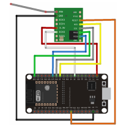
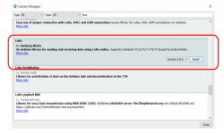
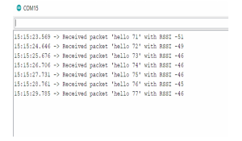
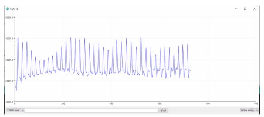

# TECHIN515 Lab 1 - LoRa with ESP32

## What is LoRa?
LoRa (from "long range") is a proprietary low-power wide-area network modulation technique. It is based on spread-spectrum modulation techniques derived from chirp spread spectrum (CSS) technology.  

LoRa uses license-free sub-gigahertz radio frequency bands like EU433 (433.05-434.79 MHz) and EU863-870 (863–870/873 MHz) in Europe; AU915-928/AS923-1 (915–928 MHz) in Australia; US902-928 (902–928 MHz) in North America; IN865-867 (865–867 MHz) in India; AU915-928/AS923-1 and EU433 Southeast Asia; and 2.4GHz worldwide. LoRa enables long-range transmissions with low power consumption. The technology covers the physical layer, while other technologies and protocols such as LoRaWAN (Long Range Wide Area Network) cover the upper layers. It can achieve data rates between 0.3 kbit/s and 27 kbit/s, depending upon the spreading factor.

## When Should we use LoRa?

While LoRa is not as fast speed as 5G or Bluetooth, it consumes much less power and has a communication range reaching more than six miles.  


LoRa has many advantages:  

● Ultra low power- LoRaWAN end devices are optimized to operate in low power
 mode and can last up to 10 years on a single coin cell battery.  
   
 ● Longrange-LoRaWANgateways can transmit and receive signals over a distance
 of over 10 kilometers in rural areas and up to 3 kilometers in dense urban areas.
   
 ● Deepindoor penetration- LoRaWAN networks can provide deep indoor coverage,
 and easily cover multi floor buildings.  

 ● License free spectrum- You don’t have to pay expensive frequency spectrum
 license fees to deploy a LoRaWAN network.  

 ● Roaming-LoRaWANend devices can perform seamless handovers from one
 network to another.  

 ● Lowcost-Minimal infrastructure, low-cost end nodes and open source software  

  LoRa long range and low power features, makes it perfect for battery-operated sensors and
 low-power applications in:

  ● Internet of Things (IoT)

 ● Smarthome  

 ● Machine-to-machine communication  

 ## What you will need for this lab

 ● 2 ESP32 and USB cables  
 ● 2 RFM95W915MhzLoRaUltra Long Range Transceiver  
 ● 1 PPGsensor  
 ● 1 breadboard  
 ● Jumperwires and solid wires

 ## "Hello world" communication between 2 LoRa Transceivers  

 1) First, we need to connect pin headers and an antenna to each RFM95 LoRa board (pin
 ‘ANA’). The antenna can just be an open jumper wire (one side to ‘ANA’, another side not
 connected to anything). Please notice that the distance of the pins on the LoRa board is shorter
 than normal 0.1’ pin headers that we use. So you may need to adjust the pin headers to fit, as
 the following figure shows.

  2) Next connect the one LoRa module to each ESP 32 according to the following schematic
 diagram:  

 

 3) Install a LoRa library in your Arduino IDE. Please notice that there are many LoRa libraries,
 make sure you install the exact one with name ‘LoRa’.

   

  4) On one ESP32-LoRa that you have just prepared, upload ‘lora_helloworld_talker.ino’, which
 will send out a message ‘hello’ every second. Make sure that you go to the line
 ``` LoRa.setSyncWord(0xF3); ```
 And change the sync word to your unique one. LoRa listens to all the messages within the
 range, so it is very important to have a unique sync word.  

  5) On another ESP32-LoRa, upload ‘lora_helloworld_listener.ino’, and change the sync word in
 line:
 ``` LoRa.setSyncWord(0xF3); ```
 This will make sure that your LoRa receiver only listens to your own sender.  

 6) If everything is fine, when you open the serial monitor (please choose the listener port), you
 should see the listener receiving messages from the talker.

   

  7)     Please take a screenshot or record a video for submission.

  ## PPG Sensor with 2 LoRa

   Now with the current structure, we could connect a PPG sensor to the sender ESP 32 as what
 we did in Techin 514, and make it a LoRa sender sending PPG signal.

  Then we can receive that
 signal using the LoRa receiver.
 An example code from Techin 514 to read PPG using ESP 32 is attached. Please modify the
 LoRa talker and listener code so that the talker can send PPG readings to the listener.

 You may
 also want to adjust the time delay in the talker code to make it more ‘realtime’.  

 Please modify the listener code so that you can visualize the PPG readings on the listener port
 using the serial plotter.

   
   
Please take a screenshot or record a video for submission.

