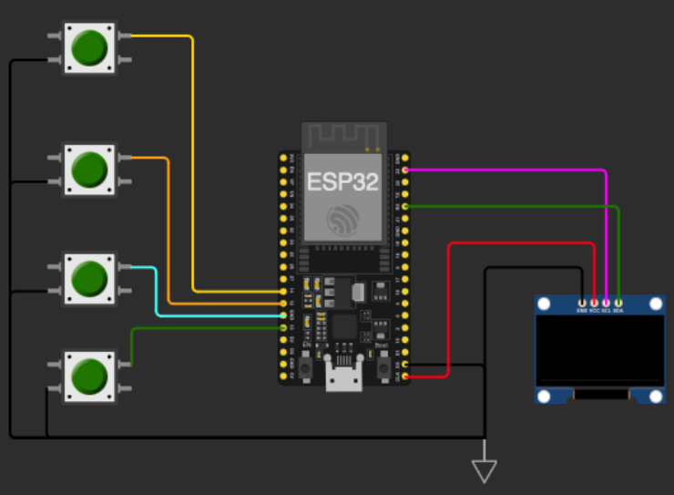

# TECHIN515 Lab 3: ESP32 Sorting Hat

## Overview

In this lab, you will build a magical sorting hat using an ESP32 and machine learning. The sorting hat will classify students into different houses based on their characteristics. 

## Learning Objectives

- Get familiar with buttons
- Develop skills in data collection and preprocessing
- Implement a classification system using decision tree
- Create an interactive and engaging user experience

## Hardware Requirements

- ESP32 development board
- 4 push buttons
- OLED display (Adafruit SSD1306)
- USB cable
- Breadboard and jumper wires

## Software Requirements

- Arduino IDE or PlatformIO
- ESP32 board support package
- Required libraries:
  - EloquentTinyML
  - Adafruit SSD1306
- Dependencies defined in `requirements.txt`

## Project Structure

```
.
├── src/                    # Source code directory for laptop
│   └── sorting_hat_laptop.py    # Python script for training the model
    ├── requirements.txt         # Python dependencies
├── sorting_hat_ESP32/
    └── sorting_hat_esp_button.ino    # ESP32 Arduino sketch
├── assets/                 # Assets directory
│   └── sorting_hat_button.png   # Wiring diagram
└── README.md               # Lab manual
```

## Dataset Structure

The dataset is stored in a CSV file with the following structure: (Note: Revise the file name accordingly for your setup)

| Question 1 | Question 2 | Question 3 | ... | House |
|------------|------------|------------|-----|-------|
| 1          | 3          | 2          | ... | Gryffindor |
| 2          | 1          | 4          | ... | Slytherin |
| 3          | 2          | 1          | ... | Hufflepuff |
| 4          | 4          | 3          | ... | Ravenclaw |

### Features

- Each question column contains integer values (1-4) representing the user's response
- The `House` column contains the target variable (Gryffindor, Slytherin, Hufflepuff, or Ravenclaw)
- Each row represents one student's complete set of responses

### Data Collection Guidelines

- Collect at least 30 entries (5 responses from 6 different students)
- Ensure **balanced representation** across all houses
- Each response should be a number between 1 and 4
- Label each complete set of responses with the appropriate house

## Tasks

1. Create your dataset to train the sorting hat.
   - Create at least five responses to all questions and label them.
   - Talk to other students, and collect responses generated by at least five other students. This should give you at least 30 entries in the dataset. You are encouraged to collect more data as you can.
2. Navigate to `src` directory. Create a virtual environment, activate it, and install the required libraries.

   For MacOS:

   ```bash
   python3 -m venv .venv

   source .venv/bin/activate

   pip install -r requirements.txt
   ```

   Fow Windows:

   ```bash
   python -m venv .venv

   .venv/Scripts/Activate

   pip install -r requirements.txt
   ```

3. Use `src/sorting_hat_laptop.py` to train your decision tree and convert it to C++ for ESP32. Depending on your dataset size, you can tune the tree depth to prevent overfitting.
4. Wire your ESP32 with buttons and OLED display. An example is shown in the figure below. Update the sketch `sorting_hat_esp_button_x_width.ino` accordingly, depending on how you wire the sorting hat and which OLED display you use. If your OLED display is 128x64, choose `x=64`. If your OLED display is 128x32, choose `x=32`.
5. Complete the `checkButtons()` logic. The starter code includes a function stub for checking button presses and recording responses. Your task is to implement the following:
   - Wait for **exactly one** of the 4 buttons to be pressed
   - Store the response as an integer (1–4) in the `responses[]` array
   - Debounce the input
   - Call the `nextQuestion()` function once an answer is recorded

   The pseudocode is as follows:

   ```cpp
   // Pseudocode:
   if (buttonStates[i] == LOW) { // If the button is pressed (LOW because of INPUT_PULLUP)
      // Save the user's answer
                    
      // Note that a button was pressed
   }

   if (buttonPressed) { // If any button was pressed (and debounced), move to next question
        
    }
   ```

   Hints:
   - Look for LOW when the button is pressed.
   - Change PIN numbers based on your wiring and board being used.



### Discussion

- Play with your sorting hat. Are all 10 questions important to create the sorting hat? If you were to remove some questions to improve user experience, which questions would you remove and justify your answer.
- If you were to improve the sorting hat, what technical improvements would you make? Consider:
  - How could you improve the model's accuracy or efficiency?
  - What additional sensors or hardware could enhance the user experience?
  - Does decision tree remain suitable for your choice of new sensors? If yes, carefully justify your answer. If not, what ML model would you use and explain why.


## Deliverables

Submit a GitHub link containing:

1. Video of your working sorting hat prototype
2. Source code with comments and dataset
3. Brief documentation of your implementation and answers to questions in lab manual
