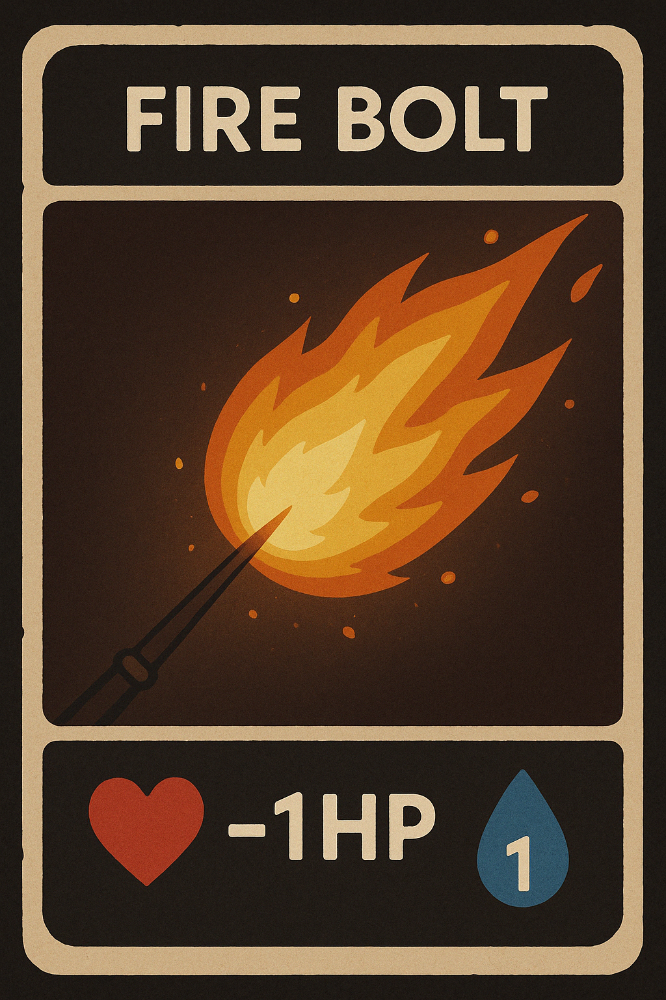
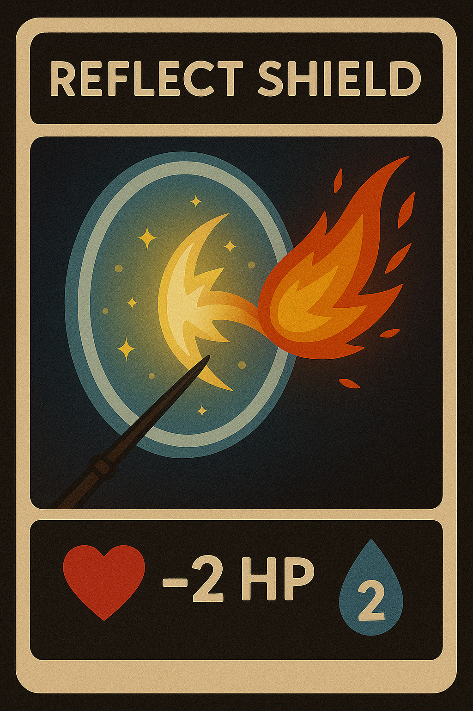
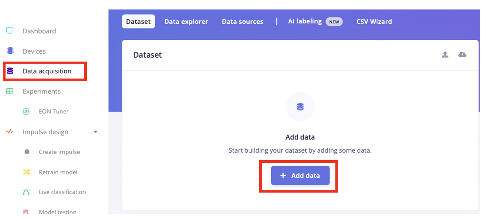
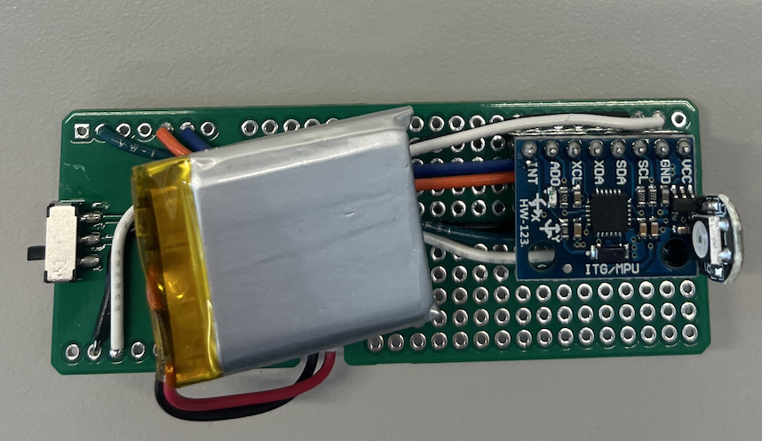

# TECHIN515 Lab 4 - Magic Wand

This project implements a gesture recognition system using an ESP32 microcontroller with an MPU6050. The system consists of two main components: a gesture data capture system and a gesture inference system.

## Learning Objectives

By completing this lab, students will:

- Understand the fundamentals of gesture recognition using IMU sensors
- Learn to collect and preprocess sensor data
- Gain experience with Edge Impulse's DSP and ML capabilities
- Develop practical skills in embedded systems programming
- Learn to optimize ML models for resource-constrained devices
- Understand the importance of proper hardware integration and user interaction

## Project Structure

```
.
├── gesture_capture/     # Tools for capturing and processing gesture data
│   ├── gesture_capture.ino    # Arduino sketch for data capture
│   ├── process_gesture_data.py # Python script for data processing
│   └── data/                  # Directory for storing gesture data
└── wand/      # Gesture recognition inference system
    └── wand.ino     # Arduino sketch for gesture recognition
```

## Hardware Requirements

- ESP32 development board
- MPU6050 sensor
- Jumper wires for connections
- Breadboard for quick prototyping
- Battery and enclosure for creating your wand

### Hardware Connections

Connect the MPU6050 to your ESP32:

- VCC → 3.3V
- GND → GND
- SCL → GPIO22 (or your I2C clock pin)
- SDA → GPIO21 (or your I2C data pin)

**Note**: Pin numbers may vary depending on your development board.

## Software Requirements

### Arduino IDE

- Arduino IDE or PlatformIO with ESP32 board support
- Required libraries:
  - Adafruit MPU6050
  - Adafruit Sensor
  - Wire (built-in)
  - Edge Impulse SDK (for inference)

### Python (for data capture)

- Python 3.8 or newer
- Required packages specified in `requirements.txt`

## Getting Started

### 1. Data Collection

1. Navigate to the `gesture_capture` directory
2. Create a new project on your laptop. Create a virtual environment, activate it, and install the required libraries in `requirements.txt`.

   For MacOS:

   ```bash
   python3 -m venv .venv

   source .venv/bin/activate

   pip install -r requirements.txt
   ```

   Fow Windows:

   ```bash
   python -m venv .venv

   .venv/Scripts/Activate

   pip install -r requirements.txt
   ```

3. Upload `gesture_capture.ino` to your ESP32
4. Run the Python script to collect gesture data:
   
   ```bash
   python process_gesture_data.py --gesture "W" --person "your_name"
   ```

   Here "W" represents the gesture. Name it appropriately based on the gesture being recorded.
5. Follow the on-screen instructions to capture gestures. The Python script should create a subdirectory as follows:

   ```
   .
   ├── data/     # Data directory
   │   ├── O         # All gesture data labeled with O
   │   ├── V         # All gesture data labeled with V
   ```
6. Collect gesture data for the following three spells:
   1. **Fire Bolt**<--->Gesture "Z": Deal 1HP from your opponent, consuming 1MP
   2. **Reflect Shield**<--->Gesture "O": Reflect Fire Bold from your opponent with doubled damage and consume 2MP
   3. **Healing Spell**<--->Gesture "$\land$": Heal yourself with 1HP, consuming 2MP

<p float="left">
  
   
  
</p>
   <sub>Images are generated by OpenAI GPT-4o.</sub>

### 2. Gesture Recognition

1. Navigate to the `wand_inference` directory
2. Upload `wand_inference.ino` to your ESP32
3. Open the Serial Monitor at 115200 baud
4. Send 'o' to start gesture capture
5. The system will automatically recognize and classify the gesture

## Data Format

The gesture data is stored in CSV format with four columns:

- Timestamp
- x: X-axis acceleration (m/s²)
- y: Y-axis acceleration (m/s²)
- z: Z-axis acceleration (m/s²)

Each capture contains approximately 100 samples (1 second at 100Hz).

## Wand Inference System

The wand inference system uses Edge Impulse for real-time gesture recognition. Here's how it works:

### Features

- Real-time gesture recognition at 100Hz sampling rate
- 1-second gesture capture window
- Automatic gesture classification
- Confidence score for each prediction

### How It Works

1. The system continuously monitors the MPU6050 accelerometer
2. When triggered (by sending 'o' via Serial), it captures 1 second of accelerometer data
3. The captured data is processed using the Edge Impulse model
4. The system outputs the predicted gesture and confidence score

### Configuration

The inference system is configured with:

- Sampling rate: 100Hz (10ms between samples)
- Capture duration: 1 second
- Accelerometer range: ±8g
- Gyroscope range: ±500°/s
- Filter bandwidth: 21Hz

### Output Format

The system outputs predictions in the following format:

```
Prediction: [gesture_name] (confidence_percentage%)
```

## Tasks

### Part 0: Preparation

1. Create a new project in Edge Impulse and complete the Audio classification tutorial.
2. You are encouraged to reveiw the Motion Recognition tutorial.

### Part 1: Data Collection

1. Set up the hardware and collect data:
   - Connect the MPU6050 to your ESP32. **Note**: How MPU6050 is placed on bread board should be consistent with your future plan when prototyping your wand.
   - Use the provided `gesture_capture.ino` sketch and `process_gesture_data.py` to record gesture data. Your data should cover all gestures shown in the spell cards.
   - For each gesture, collect at least 20 samples. Ensure good quality data by performing the gesture consistently.
   - Save all data in the `data` directory with clear naming conventions.

   **Note**: You are allowed to share your recorded data with others. However, you need to collect your own data.

2. **Discussion**: Why should you use training data collected by multiple students rather than using your own collected data only? Think about the **effectiveness** and **reliability** of your wand.

### Part 2: Edge Impulse Model Development

1. Create a new project in Edge Impulse:
   - Upload your collected gesture data as shown in the screenshot below
     - Choose "Select a folder" as upload mode
     - Choose the data directory on your laptop
     - Use "Automatically split between training and testing"
     - Correclty enter your label for each file
     - By clicking on each data sample, you should visualize the data on the right hand side panel
   
   

2. Design and implement the model:
   - Click on "Impulse Design" tab of the sidebar and create a new impulse
     - Depending on your MCU, choose target device accordingly, e.g., "Espressif ESP-EYE (ESP32 240MHz)"
     - Leave other fields as deafult
   - In the data block, use the default setup.
   - Add a processing block. Read through the available options and pick one for your impulse. Justify your option.
   - Add a learning block. Read through the available options and pick one for your impulse. Justify your option.
   - Save your impulse.

3. Choose your DSP block in the sidebar.
   - Tune the hyperparameters and visualize the generated features until you are satisfied with the features.
   - Take a screenshot of your generated features, and sketch a rough decision boundary between classes. Explain why do you believe the generated features are good enough.
4. Choose your ML block in the side bar.
   - Tune the number of training epochs, learning rate, and neural network architecture until you are satisfied with the learning performance.
   - Report the learning performance, your choices of hyper-parameters, and architecture.
5. Use "Live classification" and "Model testing" in sidebar to test your model performance.
6. Choose "Deployment" tab in sidebar.
   - Find Arduino Library in the search bar
   - Check Quantized (Int8) box, build the model and download it.

### Part 3: ESP32 Implementation

1. Deploy the model to your ESP32 and use `wand.ino` to test its performance with real-time gestures. **Note**: You need to rename header file (Line 18) accordingly.
2. Repeat your testing for a few times, and use appropriate metrics to document your wand's performance.
3. Modify the provided `wand.ino` code: Implement a button-triggered inference: ESP32 predicts the gesture once the button is pressed.
4. Test your code to ensure your wand functions.
5. Create a demo video showing your implementation.

### Part 4: Battery and Enclosure

1. Power your ESP32 using a battery rather than USB cable.
2. Use appropriate enclosure for your wand.
3. The prototyping lab has pre-built a board with battery, MCU, swithc, and sensor for your uses. Check it out with the instructional team.



## Deliverables

1. Code and Documentation:
   - All Arduino sketches with comments
   - Python scripts for data collection
   - Your dataset
   - Edge Impulse project export
   - README with setup instructions

2. Report (PDF format) including:
   - Pictures of hardware setup and connections
   - Data collection process and results
   - Edge Impulse model architecture and optimization
   - Performance analysis and metrics
   - Answers to questions and your choices to all design options with justifications
   - Demo video link
   - Challenges faced and solutions

3. Demo Video (less than 3 minutes):
   - Show hardware setup
   - Demonstrate data collection
   - Show real-time gesture recognition
   - Include performance metrics

4. Enclosure and Battery are due on **May 20th, 2025**.
   - Components including board, MCU, IMU sensor, and wiring should be fully enclosed.
   - Use mounting holes to stablize the board within your wand.
   - Use reasonable enclosure based on your background in TECHIN511. For example, a box or staff is considered and **inappropriate enclosure** for the wand.
  
## Troubleshooting

- **Port not found**: Specify the port manually with `--port COM3` (Windows) or `--port /dev/ttyUSB0` (Linux/Mac)
- **Permission denied**: On Linux/Mac, run `sudo chmod 666 /dev/ttyUSB0` (replace with your port)
- **No data received**: Check connections and ensure the sketch is uploaded correctly
