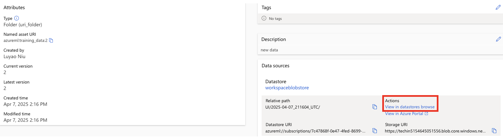
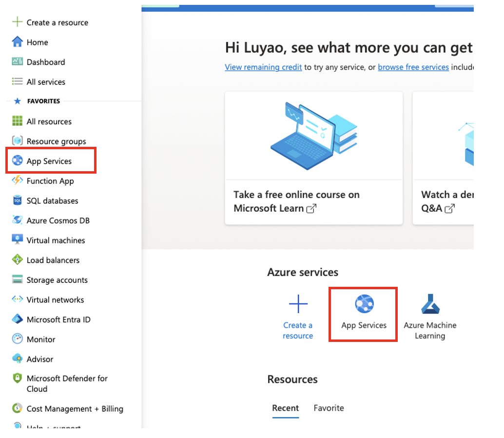

# TECHIN515 Lab 5 - Edge-Cloud Offloading

This project builds upon lab 4. We will implement an edge-cloud offloading strategy, which performs inference or computation locally on ESP32, and offloads it to the cloud (Microsoft Azure) under certain conditions.

The outline of this lab is as follows:
- Train and host a model in Azure
- Deploy the model endpoint as a web app
- Configure magic wand to offload to cloud when uncertain

## Learning Objectives

By completing this lab, students will:
- Be capable of training and hosting models in Azure
- Deploy model as a web app
- Understand cloud-edge offloading

## Project Structure

```
.
├── ESP32_to_cloud/             # ESP32 Arduino code
│   └── ESP32_to_cloud.ino      # Main ESP32 sketch
├── trainer_scripts             # Scripts
    ├── train.ipynb                 # Model training script
    ├── model_register.ipynb        # Model register script
├── wand-app/                   # Web app for model deployment
    ├── wand_model.h5               # trained model
    ├── app.py                      # Script of web app
    ├── requirements.txt            # Dependencies required by web app
└── data/                       # Training data directory
    ├── O/                           # O-shape gesture samples
    ├── V/                           # V-shape gesture samples
    ├── some_class/                  # Some other class gesture samples
    └── some_class/                  # Some other gesture samples
```


```
wand-app/
├── wand_model.h5
├── app.py
├── requirements.txt
```

## Hardware Requirements

- Your magic wand from Lab 4

## Software Requirements

### Arduino IDE

- Arduino IDE with ESP32 board support
- Required libraries:
  - Adafruit MPU6050
  - Adafruit Sensor
  - Wire (built-in)

### Microsoft Azure account

### Gesture dataset collected in previous labs

### Python (for data capture)

- Python 3.8 or newer
- Required packages (install via `pip install -r requirements.txt`)

## Getting Started

### 1. Microsoft Azure: Resource Group

1. Navigate to [Microsoft Azure](https://azure.microsoft.com/en-us/) and sign in with your account. If you are new to Azure, you should get $200 free trial credit. 
2. Click on `Resource groups` as shown below to create a resource group.


3. Name your resource group, e.g., TECHIN515-lab, and choose the closet region, e.g., West US 2. Click `Review+Create`, then `Create` to create the resource group. You can use the default subscription "Azure subscription 1".
   - You would like to have the region close to your location to reduce latency.

### 2. Microsoft Azure: Create a Machine Learning Workspace

1. Navigate back to homepage by clicking on Microsoft Azure on top left, or use this [link](https://portal.azure.com).
2. Click on `Azure Machine Learning` as shown below.


3. Click on `+Create` to create an AzureML workspace.
   - Use default subscription, i.e., Azure subscription 1
   - Attach the workspace to the resource group you just created
   - Name your workspace, e.g., TECHIN515-lab
   - Use the same region as your resource group
   - Leave storage account, key valut, and application insights as deafult
4. Click on `Review+Create`, then `Create` to create the workspace.

### 3. Microsoft Azure: Create a Compute Instance

There are two types of compute in AzureML: Compute instance and compute cluster. The former is used for development and the latter is used for scalable training jobs.
In the following, we will create a compute instance.

1. Go to your ML workspace and click on `Compute` in the left sidebar.


2. Choose the `Compute Instances` tab, and click `+New`.
3. Fill in name, virtual machine size, and region. Note that the region should match that of your workspace.
4. Click `Create`. It may take a few minutes to create the compute instance.

### 4. Microsoft Azure: Host Data

1. Locate the training data in your laptop. We will host the data in Azure Blob. Note that as the cloud has higher computing performance and more storage, you can get merge your training data with that collected by other students to improve your model performance.
2. Go to AzureML and navigate to Data tab. Click `+Create`.
3. Name you data asset along with a brief description. Choose `Folder (uri_folder)` as type. Click `Next`.
4. Choose From local files option, and upload your training dataset. Click `Next`.
5. Leave datastore type as Azure Blob storage and click `Next`.
6. Upload your training dataset folder. Click `Next` and then `Create`.

### 5. Microsoft Azure: Model Training and Register

1. In the Compute tab, click on JupyterLab.
2. Copy the following code cell to the Jupyter Notebook.
3. Copy the provided code in `train.ipynb` to the Jupyter Notebook in Azure. Use *Python3.8-AzureML* as the kernel to run the code. Once the cell completes running, you should see a `h5` file being created.
   - Note that you need to configure the path to training dataset. To find the correct path, click on Data tab on the left sidebar, and then the dataset you created in Blobstore. Click on View in datastores brows to find the path.



4. Copy the provided code in `model_register.ipynb` to a new Jupyter Notebook in Azure. Use *Python3.10-SDK v2* as the kernel to run the code.
   - Note that you need to configure the following code block in the 3rd cell accordingly:

```
SUBSCRIPTION = "<subscription_ID>"
RESOURCE_GROUP = "<group_name>"
WS_NAME = "<workspace_name>"
```

To find such information, click the tab on top right showing your subscription and workspace name. Copy Resource Group to `RESOURCE_GROUP`, Subscription ID to `SUBSCIPTION`, and Current workspace to `WS_NAME`.

### 6. Microsoft Azure: Deploy Model via Web App

1. Go to the homepage of Azure. In the left sidebar, search `App Service` and then creat new app.
   - Choose Python as runtime
   - Region should be picked the same as your ML workspace
   - Use Free plan



2. Click `+Create` to create a web app.
   - Choose the same resource group, and name your web app.
   - Choose Python3.10 as the runtime stack.
   - Pick West US 2 as the region.
   - Choose free F1 pricing plan.
   - Click `Review+Create` and then `Create`. The deployment may take a few minutes.
3. Create a **local** folder named `app` containing the model (.h5 file). Add the provided `app.py` and `requirements.txt` files to the folder.
4. Push this folder to a GitHub repo, and copy the link of GitHub repo.
5. Go to Azure App Service, and navigate to **Deployment Center**. Deploy the web app using GitHub. Paste the link of GitHub repo to the field of repository. Use main as the branch.

### 7. Cloud-Edge Offloading

1. Complete the provided sketch template. Tune the confidence interval to control when ESP32 should consult to the cloud for gesture inference.
2. Take a picture your serial monitor for cases when ESP32 performs inference locally, and when ESP32 consults cloud for inference.

## Deliverables

1. GitHub link to your project
2. Pictures of serial monitor