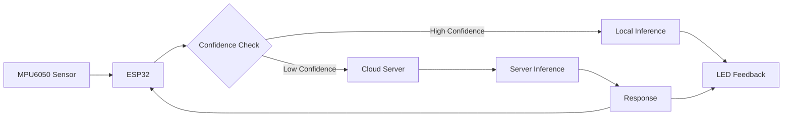

# ESP32 Cloud-Edge Offloading Gesture Recognition

This project implements a gesture recognition system using an ESP32 microcontroller with MPU6050 accelerometer, featuring a hybrid edge-cloud inference approach. The system performs local inference first and falls back to cloud-based inference when confidence is low.

## Hardware Requirements
- ESP32 Development Board
- MPU6050 Accelerometer
- RGB LED
- Push Button
- Connecting Wires

## Software Dependencies
- Arduino IDE
- Required Libraries:
  - Adafruit_MPU6050
  - Adafruit_Sensor
  - HTTPClient
  - ArduinoJson
  - WiFi

## Implementation Details

### Edge-Cloud Architecture
The system implements a confidence-based offloading strategy:
1. Local inference is performed first using the embedded model
2. If confidence is below 80%, raw sensor data is sent to the cloud server
3. The server performs inference and returns the prediction
4. LED feedback is provided based on the prediction (local or cloud)

### Data Flow

```mermaid
graph LR
    A[MPU6050 Sensor] --> B[ESP32]
    B --> C{Confidence Check}
    C -->|High Confidence| D[Local Inference]
    C -->|Low Confidence| E[Cloud Server]
    E --> F[Server Inference]
    F --> G[Response]
    G --> B
    D --> H[LED Feedback]
    G --> H
```

## Discussion Questions

### 1. Server vs. Local Confidence Comparison
From observations, the server's confidence is typically higher than the wand's local confidence. This can be attributed to several factors:
- The server model is likely more complex and has been trained on a larger dataset
- The server has more computational resources available for inference
- The server model may have been fine-tuned specifically for the gesture recognition task
- The local model is constrained by the ESP32's limited resources and memory

### 2. Data Flow Analysis
The data flow in this system follows these steps:
1. Sensor Data Collection:
   - MPU6050 captures accelerometer data
   - Data is sampled at 10ms intervals
   - 1000ms of data is collected for each gesture

2. Local Processing:
   - Data is preprocessed and formatted
   - Local inference is performed
   - Confidence is calculated

3. Cloud Offloading (if needed):
   - Raw sensor data is formatted as JSON
   - Data is sent to the server via HTTP POST
   - Server performs inference
   - Results are returned to the ESP32

4. Feedback:
   - LED indication based on the prediction
   - Serial output for debugging

### 3. Edge-First Approach Analysis

#### Pros:
- **Connectivity**: Works offline when confidence is high
- **Latency**: Lower latency for high-confidence predictions
- **Privacy**: Sensitive data stays local when possible
- **Bandwidth**: Reduces network usage for clear cases
- **Battery**: More efficient for high-confidence cases

#### Cons:
- **Connectivity**: Still requires internet for uncertain cases
- **Latency**: Additional delay when falling back to cloud
- **Consistency**: Potential inconsistency between local and cloud predictions
- **Privacy**: Data is still sent to cloud in uncertain cases
- **Complexity**: More complex implementation and maintenance

### 4. Mitigation Strategy
To mitigate the connectivity reliance limitation, we could implement:
- **Local Cache**: Store recent cloud predictions locally
- **Offline Mode**: Allow users to force local-only mode
- **Batch Processing**: Queue uncertain predictions and send them when connection is available
- **Progressive Enhancement**: Start with a simpler local model and update it based on cloud feedback

## Future Improvements
1. Implement local model updates based on cloud feedback
2. Add support for more gesture types
3. Implement data compression for cloud transmission
4. Add error recovery mechanisms for network failures
5. Implement a more sophisticated confidence threshold system

## Setup Instructions
1. Configure WiFi credentials in the code
2. Update server URL if needed
3. Upload the code to ESP32
4. Ensure the server is running and accessible
5. Test the system with various gestures

## Troubleshooting
- Check serial monitor for debugging information
- Verify WiFi connection
- Ensure server is running and accessible
- Check LED connections
- Verify MPU6050 connections 